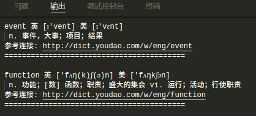
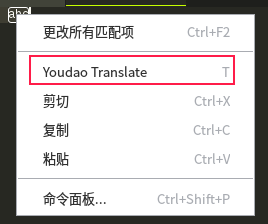

# youdao-translator README

利用有道字典, 翻译选中的单词或句子.






## 特性

1. 翻译单词
2. 翻译句子
3. 支持音标展示
4. 查询缓存
5. 查询过的单词, mouseover会显示出来
6. 翻译中文


## 使用方法

cmd+shift+p 调出命令面板， 输入 youdao translate，即可翻译选中的文本。

也可以选中相关字符串后按快捷键进行翻译。

默认：

Mac: cmd+shift+t

其他: meta+t     (meta即window徽标键)


## 配置快捷键
```
{
    "key": "meta+t",
    "command": "extension.youdaoTranslate",
    "when": "editorTextFocus"
}
```


