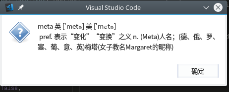
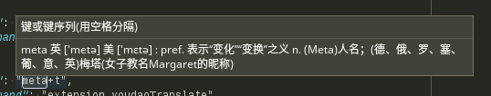
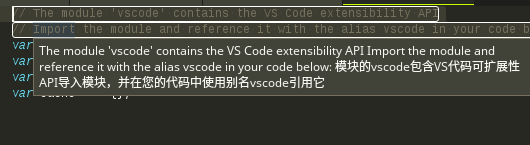

# youdao-translator README

利用有道字典, 翻译选中的单词或句子.







## 特性

1. 翻译单词
2. 翻译句子
3. 支持音标展示
4. 查询缓存
5. 查询过的单词, mouseover会显示出来


## 使用方法

cmd+shift+p 调出命令面板， 输入 youdao translate，即可翻译选中的文本。

也可以选中相关字符串后按快捷键进行翻译。

默认：

Mac: cmd+shift+t

其他: meta+t     (meta即window徽标键)


## 配置快捷键
```
{
    "key": "meta+t",
    "command": "extension.youdaoTranslate",
    "when": "editorTextFocus"
}
```


## Release Notes

### [0.0.1]

- 初始版本

### [0.0.2]

- 添加图片

### [0.0.3]

- 添加快捷键

### [0.0.4]

- bug修复

### [0.0.5]

- 添加request依赖

### [0.0.6]

- 更新request依赖

### [0.0.7]

- 已经查询过的单词, mouseover会显示出来

### [0.0.8]

- 更新截图使用说明， 翻译去除'"

### [0.10.4]

- npm使用新版(npm -g install npm)，解决boom依赖问题

-----------------------------------------------------------------------------------------------------------

## 赞助

如果你觉得好用, 请赞助一下, 谢谢支持:
